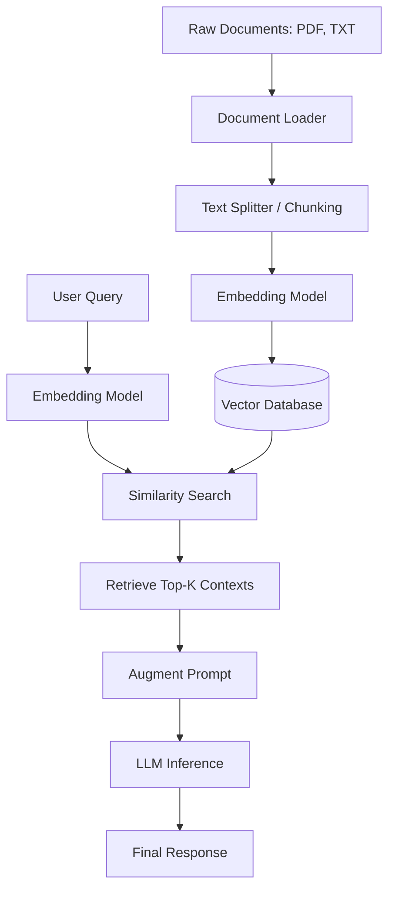

# Onboarding Progress Report


## 1. DeepFace Exploration
DeepFace was successfully configured locally to test its core facial analysis pipeline.

### Core Pipelines Tested:
- **Face Detection & Preprocessing**: Extracting faces from images and aligning them.
- **Face Verification**: Comparing two face images to determine if they belong to the same person.
- **Face Recognition**: Searching for a query face within a local database of images.
- **Facial Attribute Analysis**: Extracting demographic features:
  - **Emotion Detection** (e.g., Happy, Sad, Neutral)
  - **Age Prediction**
  - **Gender Prediction**
  - **Race Prediction**
- **Real-Time Streaming**: Running real-time analysis on a video feed.


#### Demographic Analysis:
```python
from deepface import DeepFace

result = DeepFace.analyze(
    img_path="C:\\Users\\ASUS\\Desktop\\DeepFace\\ronaldo1.png",
    actions=["emotion", "age", "gender", "race"]
)
print(result)
```

#### Face Verification:
```python
from deepface import DeepFace

result = DeepFace.verify(
    img1_path="C:\\Users\\ASUS\\Desktop\\DeepFace\\ronaldo1.png",
    img2_path="C:\\Users\\ASUS\\Desktop\\DeepFace\\ronaldo2.png"
)
print(result)
```

#### Face Recognition (Database Search):
```python
from deepface import DeepFace

result = DeepFace.find(
    img_path="E:\\IMP Docs\\IMG_20230521_221901_364-removebg-preview.png",
    db_path="images",
    detector_backend="Facenet"
)
print(result)
```

#### Real-Time Camera Stream Analysis:
```python
from deepface import DeepFace

DeepFace.stream(
    db_path="images",
    detector_backend="opencv",
    model_name="VGG-Face"
)
```

### Architectural Details & Models Explored:
- **Detectors**: Evaluated internal detectors like `opencv` and `Facenet`.
- **Recognition Models**: Utilized standard representation models such as `VGG-Face`.
- **Comparison & Extension**: Began analyzing alternative emotion detection models (comparing precision and performance tradeoffs against DeepFace's default).

---

## 2. Retrieval-Augmented Generation (RAG) Architecture Study
A comprehensive study of RAG workflow was conducted to establish a baseline for building context-aware applications.

### RAG Processing Flow:


### Detailed Learnings:
- **Chunking Strategies**: Explored chunk size and chunk overlap configurations (e.g., Recursive Character Text Splitting) to maintain semantic context boundaries.
- **Semantic Embeddings**: Understood how models project high-dimensional representations of text into space for vector comparisons.
- **Vector Stores**: Analyzed capabilities, query latency, and deployment patterns of major stores:
  - **Chroma** (Sleek file-based storage, ideal for local/embedded use)
  - **FAISS** (Efficient CPU/GPU similarity search)
  - **Pinecone / Qdrant / Weaviate** (Managed, scalable cloud vector databases)
  - **pgvector** (Relational SQL expansion for vector storage)

---

## 3. Flowise Context-Based Chatbot Implementation
Flowise was used to prototype and implement visual workflows for a context-based RAG chatbot. We experimented with both **Flowise Cloud** and **local Flowise** deployments.

### Configuration A: RAG Chatbot Canvas
This configuration links a file loader to Chroma using Ollama embeddings locally.


#### Canvas Details:
- **Document Ingestion**:
  - **File Loader**: Configured to parse file `2 Sem.pdf` and output a document stream.
  - **Text Splitter**: Connected to the File Loader using a **Recursive Character Text Splitter** with:
    - **Chunk Size**: `1000` characters
    - **Chunk Overlap**: `200` characters
- **Embeddings**:
  - **Ollama Embedding** connected to local endpoint `http://localhost:11434` running the `llama2` model.
- **Vector Database**:
  - **Chroma Vector Store** initialized with collection name `sample` producing a `Chroma Retriever` output.

---

### Configuration B: Document Store (Upsertion Pipeline)
This configuration manages background ingestion, document tracking, and record storage.


#### Document Store Components:
- **Source**: Ingesting `Promotion_Permission_Proposal.pdf` into `doc-store`.
- **Embeddings**:
  - **Ollama Embedding** connected to `http://localhost:11434` with model `llama-text-embed-v2` and `Use MMap` enabled.
- **Vector Store**:
  - **Chroma** configured to query top-k results (`Top K: 4`).
- **Record Manager**:
  - **MySQL Record Manager** configured with database `hawc_db` at `127.0.0.1:3306` to track document hashes, prevent duplicate upserts, and manage data cleanup (`Cleanup: Full`).

---

### Key Technical Challenges Encountered & Resolutions:
> [!WARNING]
> **Chroma Cloud Server Compatibility**: Using Chroma on Flowise Cloud requires an external host database (cannot run as a local SQLite-backed file database). Configured external credentials and endpoints to bridge the flow.
> 
> **MySQL Record Manager Integration**: Configured upsert tables (`upsertion_records`) to prevent document re-indexing overhead in database `hawc_db`.
> 
> **Local Flowise Setup**: Encountered NodeJS dependency version conflicts during local Flowise installation. Resolving package matches for native bindings like sqlite3 and canvas.

---

## 4. Next Steps
1. **Dependency Resolution**: Complete the troubleshooting of local Flowise Node.js package conflicts.
2. **Cloud Vector Database Migration**: Establish an external Chroma instance or test alternative vector databases (e.g. Pinecone/Qdrant) for the cloud-hosted Flowise bot.
3. **Emotion Model Comparison**: Benchmark accuracy and execution speed of other lightweight convolutional neural networks (CNNs) against DeepFace's default emotion classifier.
